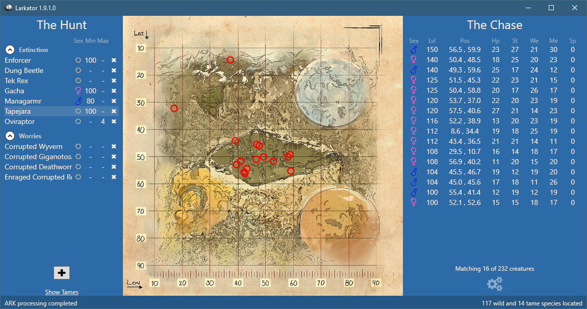

# Larkator : ARK Dino Finder
> Reads your ARK. Finds your dinos.

### What is is?
Need help locating your next high-stat tame for better dino breeding?
Larkator uses your ARK save file to help you locate both wild and tamed creatures.

### Features
 - Find both wild and tamed creatures
 - Filter based on species, gender, min and max levels
 - Show the results on a map with full coordinates
 - Helps you find your lost tames
 - Creature stats are shown to help you find that elusive next tame
 - Automatically re-reads your save file when it changes
 - Supports all five of the standard ARK maps

### Requirements
Larkator requires **ark-tools** to be installed (or at least, extracted).
On first run Larkator will ask you to locate it.
You can get it from the [forum post](https://survivetheark.com/index.php?/forums/topic/80750-ark-tools-v064-tools-for-reading-and-manipulating-ark-savegame-files/),
or directly from [Qowyn/ark-tools](https://github.com/Qowyn/ark-tools/releases).

(note: Larkator now updates the ark-tools database (*update-data*) each time it is launched)

### Limitations
Larkator is already very useful, but it is still new and is limited in some ways.

 - None of the new Aberation stats are shown

### Installation
For full step-by-step installation instructions refer to the [wiki](https://github.com/coldino/Larkator/wiki/Installation).

### Use and Tips
 - Larkator will use ark-tools to translate your saved ARK on first load and each time it changes. A large spinning cog appears over the map while this is happening. No changes are made to your saved ARK as the translated output lives in Temp.
 - Select a filter on the left side of the window to show a map of the results. Details of the results are show on the right.
 - Use your mouse's scroll wheel over a search filter's gender and level selector to change them.
 - To add a new species click the big add button. Set a category name, the species and any other filters you would like then click add.
 - Filters can be dragged around in the list to re-order or change categories.
 - While ingame, use the command `saveworld` to force the game to save - Larkator will update immediately
 - Locate that max-level Quetzal and go get it!

### Known Issues
See the [known issues](https://github.com/coldino/Larkator/wiki/Known-Issues) page on the wiki.

### License
Larkator is Open Source and released under the MIT license. Contributions are encouraged.

### Thanks
Thanks to [Roland Firmont (Qowyn)](https://github.com/Qowyn) for ark-tools, without which this tool would not be possible.

The project includes [ListView Layout Manager](https://www.codeproject.com/Articles/25058/ListView-Layout-Manager) from Jani Giannoudis.
